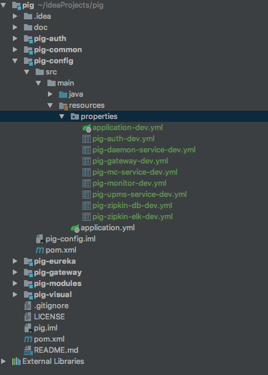
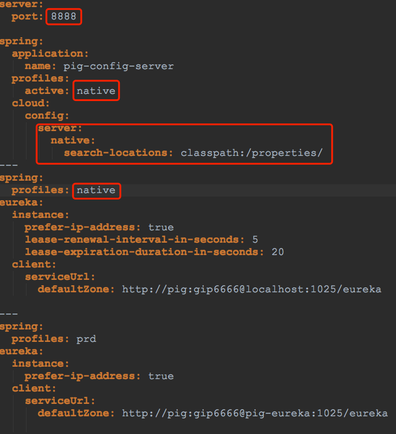

## 为了解决有的时候使用Git作为Config Server托管中心拉取配置失败的问题
> 学习Spring Cloud有一段时间了，今天在码云上看见一个非常不错的 Spring Cloud的项目 ***[Pig](https://gitee.com/log4j/pig)*** ,功能十分强大，配套教程、文档也特别全。这么牛逼的项目不得down下来学习学习？
于是clone下来，跟着视频安装好了各种环境，本以为万无一失的挨个启动就可以了。没想到启动到Config Server的时候并没有从Git服务器上拉取到配置信息。也去群里询问了，也问了作者 `@冷冷` 搞了半天也不行。后来觉得可能是公司的网管为了信息安全把一些端口给禁掉了，所有就想到把配置文件本地化了。

下面我们就来看看如何将配置文件本地化。

1. 首先，我们先把配置文件从自己的Git服务器上拉取到本地。
```
git clone https://gitee.com/cqzqxq_lxh/pig-config.git
git checkout dev

```
2. 然后，拉取Spring Cloud 项目。
```
git clone https://gitee.com/log4j/pig.git

```
3. 在pig-config模块下创建文件夹，把刚刚clone下来的配置文件拷贝到 `properties`文件夹中。

4. 最后修改pig-config模块下的配置文件 `application.yml`。


`注意：`项目的启动腰包所有的配置文件的端口、Ip、用户名、密码之类的配置要改成自己的。

以上。