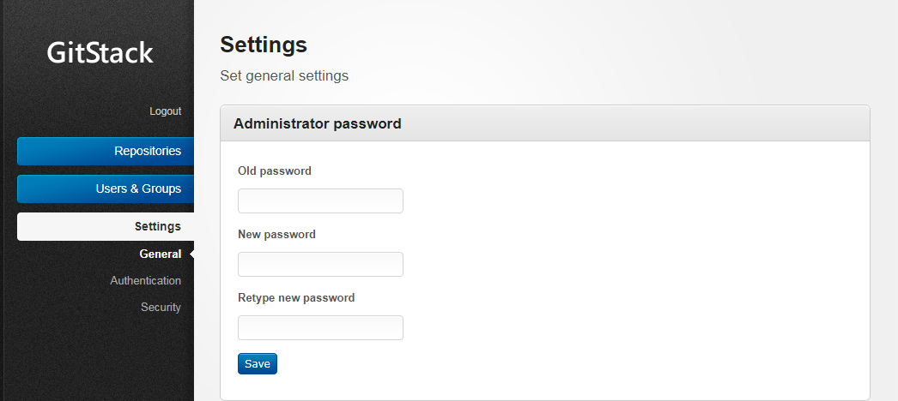
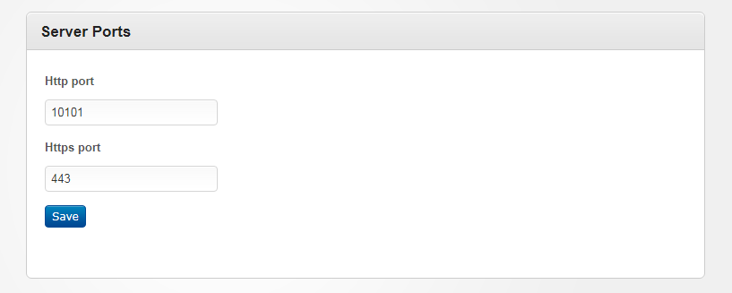
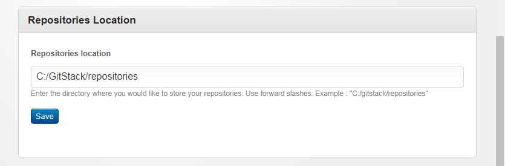
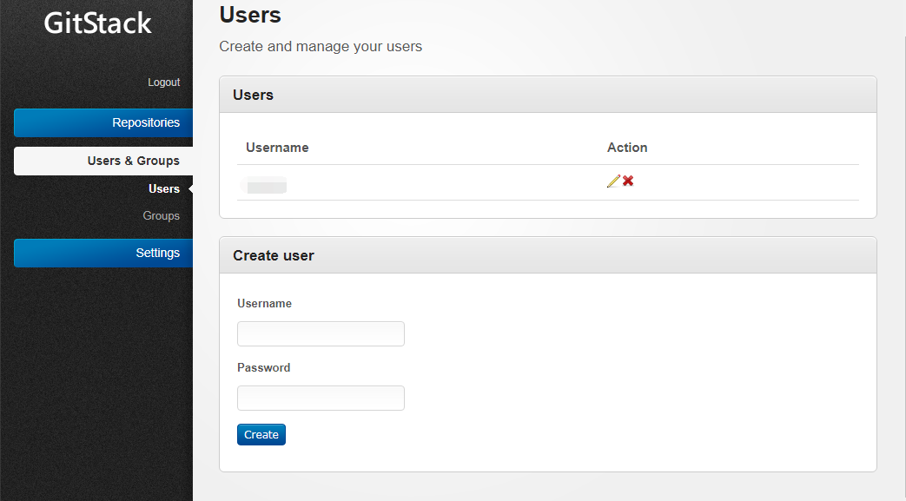
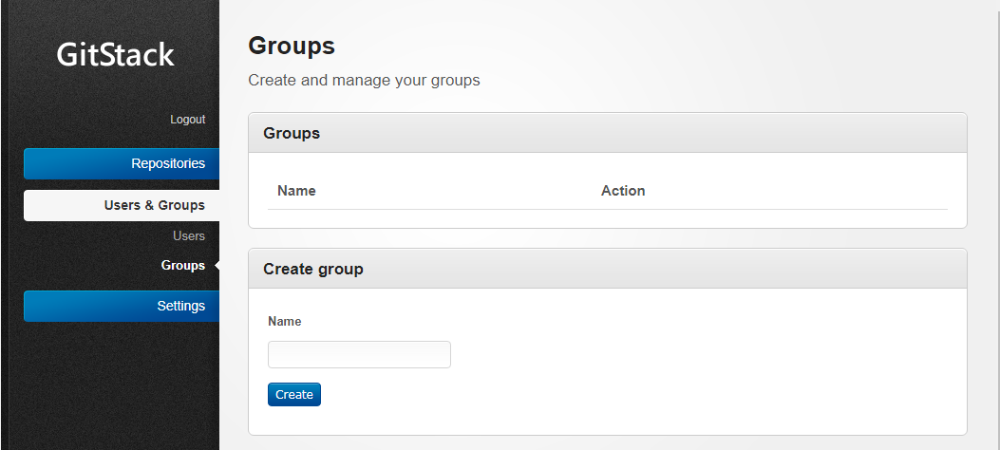
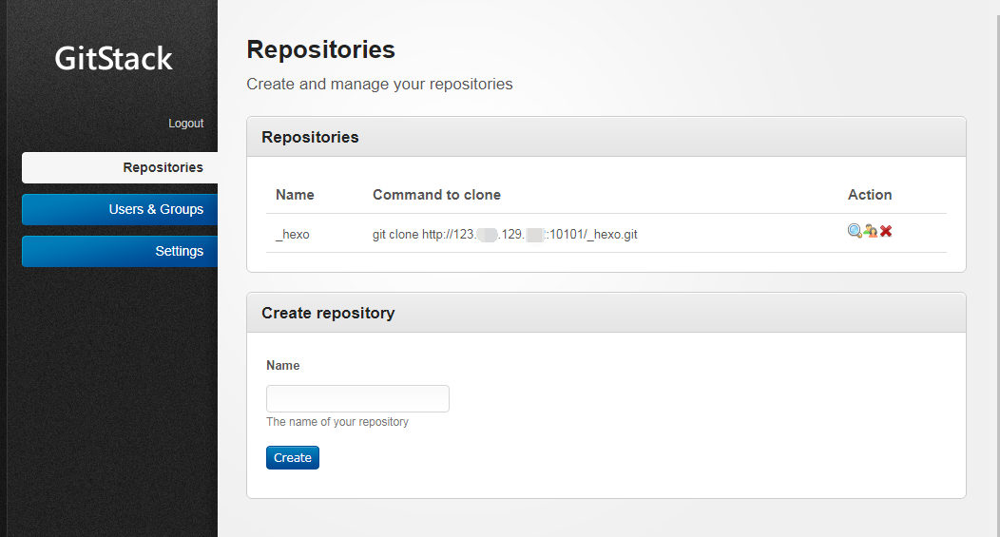
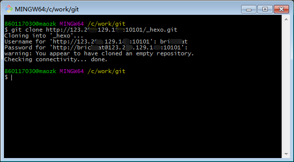

## 初衷 
　　由于在GitHub上的私有项目是付费的，并且用GitHub Pages 搭建Hexo博客有的时候慢的真的想砸了电脑。所以就想自己搭建一个Git服务器，用于放一些私有项目和搭建一个Hexo博客。
　　下面就跟着我一起来用最简单的方法搭建Git服务器吧~ <!-- more -->

## 下载相关软件
　　[gitstack](http://gitstack.com/download/)

### 安装
　　下载完后双击就可以，安装的过程中是默认用**80端口**的，先把占用80端口的进程Kill掉。重新启动程序。一路下一步就好。安装的过程中也可以自定义安装目录。安装完成后在浏览器中输入`http://localhost/gitstack`就可以访问了，默认用户名密码是admin/admin。
　　
### 配置

#### 基本配置

- 修改密码：在**Settings**->**general**->**Administrator password**中修改默认的密码。

- 修改端口：在**Settings**->**general**->**Server Ports**中修改端口号，后续访问的话就是IP地址加端口号访问。

- 修改仓库地址：**Settings**->**general**->**Repositories Location**中修改该地址。

#### 添加用户和组

- 添加用户

- 添加组

#### 创建Repositories

创建完Repositories要给它添加用户的，否则访问不了。注意：**管理员账户并不能访问这个Repositories**。

### 最后

git clone 你创建的Repositories，提示你输入用户名密码，就能把项目clone下来。

## 预告
搭建不依赖于GitHub Pages 的 Hexo 博客。
