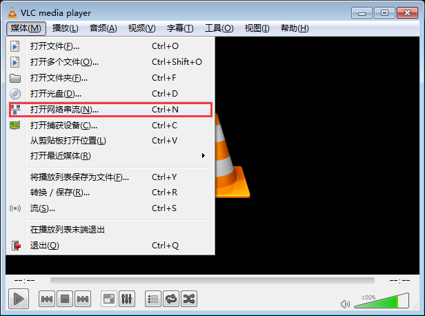

# 理论
## 什么是流媒体服务器

　　流媒体指以流方式在网络中传送音频、视频和多媒体文件的媒体形式。相对于下载后观看的网络播放形式而言，流媒体的典型特征是把连续的音频和视频信息压缩后放到网络服务器上，用户边下载边观看，而不必等待整个文件下载完毕。
由于流媒体技术的优越性，该技术广泛应用于视频点播、视频会议、远程教育、远程医疗和在线直播系统中。
<!-- more -->   作为新一代互联网应用的标志，流媒体技术在近几年得到了飞速的发展。
流媒体服务器是流媒体应用的核心系统，是运营商向用户提供视频服务的关键平台。流媒体服务器的主要功能是对流媒体内容进行采集、
缓存、调度和传输播放。流媒体应用系统的主要性能体现都取决于媒体服务器的性能和服务质量。因此，流媒体服务器是流媒体应用系统的基础，也是最主要的组成部分。

## 什么是HLS (HTTP Live Streaming)

　　常用的流媒体协议主要有 HTTP 渐进下载和基于 RTSP/RTP 的实时流媒体协议，这二种基本是完全不同的东西，目前比较方便又好用的是用 HTTP 渐进下载方法。在这个中 apple 公司的 HTTP Live Streaming 是这个方面的代表。它最初是苹果公司针对iPhone、iPod、iTouch和iPad等移动设备而开发的流.现在见到在桌面也有很多应用了，HTML5 是直接支持这个。
但是HLS协议的小切片方式会生成大量的文件，存储或处理这些文件会造成大量资源浪费。如果要实现数天的时移，索引量将会是个巨额数字，并明显影响请求速度。因此，HLS协议对存储I/O要求相当苛刻。对此，也有公司提出了非常好的解决方案。
　　新型点播服务器系统，独创了内存缓存数据实时切片技术，颠覆了这种传统实现方法，从根本上解决了大量切片的碎片问题，使得单台服务器的切片与打包能力不再是瓶颈。其基本原理如下：
　　不将TS切片文件存到磁盘，而是存在内存当中，这种技术使得服务器的磁盘上面不再会有“数以吨计”的文件碎片，极大减少了磁盘的I/O次数，延长了服务器磁盘的使用寿命，极大提高了服务器运行的稳定性。同时，由于使用这种技术，使得终端请求数据时直接从服务器的内存中获取，极大提高了对终端数据请求的反应速度，优化了视频观看体验。

## 什么是FFmpeg
　　FFmpeg是一套可以用来记录、转换数字音频、视频，并能将其转化为流的开源计算机程序。采用LGPL或GPL许可证。它提供了录制、转换以及流化音视频的完整解决方案。它包含了非常先进的音频/视频编解码库libavcodec，为了保证高可移植性和编解码质量，libavcodec里很多code都是从头开发的。

## 什么是Nginx
　　Nginx (engine x) 是一个高性能的HTTP和反向代理服务器，也是一个IMAP/POP3/SMTP服务器。

# 实践
## 安装
　　JAVA环境不在这里赘述，自行百度。博主这里是Windows server 2012的环境，后续会出Mac、Linux环境的教程。
### 安装Nginx
[Nginx-1.12.0 stable](http://nginx.org/en/download.html)
- 查看Nginx的版本号：nginx -v
- 启动Nginx: cd 安装目录 ，start nginx
- 快速停止或关闭Nginx：nginx -s stop
- 正常停止或关闭Nginx：nginx -s quit
- 配置文件修改重装载命令：nginx -s reload

### 安装FFmpeg
[FFmpeg](http://ffmpeg.zeranoe.com/builds/)
　　根据自己的操作系统选择下载最新的32位或64位静态程序版本。
## 配置
### 配置nginx
　　博主感觉Nginx真的是一个好东西，能做点播服务器、直播服务器、文件服务器、负载均衡等等一些牛逼的功能。深入了解只有不得不佩服它的的强大。
下面就跟着博主一起去见识一下`Nginx`吧（后续博主会写`Nginx`配置https和wss以及一个IP绑定多个域名等）。
- 直接解压缩就好了，windows下直接点击nginx.exe就可以启动Nginx，在浏览器里访问[http://localhost](http://localhost)就可以看到`Nigix`的欢迎页面。由于`Nginx`默认使用80端口可能会被占用。
你要先kill掉占用80端口的进程。
- 在conf文件夹中打开`mine.types`文件。
   在`application/zip          zip;`后面加上如下两行：
   ```
   application/x-mpegURL 				  m3u8; 
   application/vnd.apple.mpegurl 		  m3u8;
   ```
   然后在`video/x-msvideo                       avi;`添加`video/MP2T 							  ts;`
- 打开`nginx.conf`文件，（最好先备份一下）
    下面就是如何配置`Nginx`的代码
    ``` javascript
    #user  nobody;
    worker_processes  1;#要开启的进程数 一般等于cpu的总核数 其实一般情况下开4个或8个就可 我开2个
    
    #error_log  logs/error.log;
    #error_log  logs/error.log  notice;
    #error_log  logs/error.log  info;
    
    #pid        logs/nginx.pid;
    
    
    events {
        worker_connections  1024;#默认最大的并发数为1024，如果你的网站访问量过大，已经远远超过1024这个并发数，那你就要修改worker_connecions这个值 ，这个值越大，并发数也有就大。当然，你一定要按照你自己的实际情况而定，也不能设置太大，不能让你的CPU跑满100%。
    }
    
    
    http {
        include       mime.types;
        
        #解决Nginx跨域访问 Begin
        
        default_type  application/octet-stream;
    	add_header Cache-Control no-cache;
        add_header 'Access-Control-Allow-Origin' '*' always;
        add_header 'Access-Control-Expose-Headers' 'Content-Length,Content-Range';
        add_header 'Access-Control-Allow-Headers' 'Range';
        
         #解决Nginx跨域访问 End
         
        #log_format  main  '$remote_addr - $remote_user [$time_local] "$request" '
        #                  '$status $body_bytes_sent "$http_referer" '
        #                  '"$http_user_agent" "$http_x_forwarded_for"';
    
        #access_log  logs/access.log  main;
    
        sendfile        on;
        #tcp_nopush     on;
    
        #keepalive_timeout  0;
        keepalive_timeout  65;
    
        #gzip  on;
    
        server {
            listen       8080;#监听的的端口默认是80
            server_name  localhost;#默认就行
    
            #charset koi8-r;
    
            #access_log  logs/host.access.log  main;
            #请求路径 /
            location / {
    			#设置HTTP Response的Content-Type
    			types{
    				application/vnd.apple.mpegurl m3u8;
    				video/MP2T ts;
    			}
    			#指定访问的根目录，也是放你视频切片文件的地方，不用配置可直接访问 如：http://localhost:8080/playList.m3u8
    			root html;
            }
            #访问.mp4格式的文件
    		 location ~ .mp4 {
                mp4;
            }
    		
            #error_page  404              /404.html;
    
            # redirect server error pages to the static page /50x.html
            #
            error_page   500 502 503 504  /50x.html;
            location = /50x.html {
                root   html;
            }
    
            # proxy the PHP scripts to Apache listening on 127.0.0.1:80
            #
            #location ~ \.php$ {
            #    proxy_pass   http://127.0.0.1;
            #}
    
            # pass the PHP scripts to FastCGI server listening on 127.0.0.1:9000
            #
            #location ~ \.php$ {
            #    root           html;
            #    fastcgi_pass   127.0.0.1:9000;
            #    fastcgi_index  index.php;
            #    fastcgi_param  SCRIPT_FILENAME  /scripts$fastcgi_script_name;
            #    include        fastcgi_params;
            #}
    
            # deny access to .htaccess files, if Apache's document root
            # concurs with nginx's one
            #
            #location ~ /\.ht {
            #    deny  all;
            #}
        }
    
    
        # another virtual host using mix of IP-, name-, and port-based configuration
        #
        #server {
        #    listen       8000;
        #    listen       somename:8080;
        #    server_name  somename  alias  another.alias;
    
        #    location / {
        #        root   html;
        #        index  index.html index.htm;
        #    }
        #}
    
    
        # HTTPS server
        #
        #server {
        #    listen       443 ssl;
        #    server_name  localhost;
    
        #    ssl_certificate      cert.pem;
        #    ssl_certificate_key  cert.key;
    
        #    ssl_session_cache    shared:SSL:1m;
        #    ssl_session_timeout  5m;
    
        #    ssl_ciphers  HIGH:!aNULL:!MD5;
        #    ssl_prefer_server_ciphers  on;
    
        #    location / {
        #        root   html;
        #        index  index.html index.htm;
        #    }
        #}
    
        }
    ```
    到这里Nginx全部配置完成。
    
### 配置FFmpeg

#### 配置环境变量

- 解压缩后它会生成一个类似名为“ffmpeg-20150504-Git-eb9fb50-win32-static”的新文件夹，重命名为ffmpeg
    配置
- 配置环境变量
  点击“开始菜单”，再点击“控制面板”，再点击“系统与安全”，再点击“系统”，然后点击“高级系统设置”，跳出“系统属性”窗口后，最后点击“环境变量”按钮：
  
  点击“环境变量”按钮后，跳出“环境变量”窗口，找到并选中“Path”变量，点击编辑：
  
  在“Path”变量原有变量值内容上加上“;d:\ffmpeg\bin”（注：;代表间隔，不可遗漏；d:\ffmpeg\bin代表FFmpeg的安装路径下的bin文件夹），一路点击“确定”即可。
  
  打开命令提示符窗口。输入命令“ffmpeg  –version”。如果命令提示窗口返回FFmpeg的版本信息，那么就说明安装成功了，你可以在命令提示行中任意文件夹下运行FFmpeg。
  

#### 视频切片与访问

- 命令：
  ```
  ffmpeg -i output.mp4 -c:v libx264 -c:a aac -strict -2 -f hls -hls_list_size 0 -hls_time 5 output.m3u8
  ```
  输入与输出的文件都可以添加路径。如：`ffmpeg -i C:\Users\Desktop\output.mp4 -c:v libx264 -c:a aac -strict -2 -f hls -hls_list_size 0 -hls_time 5 C:\Users\Desktop\nginx-1.12.0\html\output.m3u8`
  `-hls_list_size` n:设置播放列表保存的最多条目，设置为0会保存有所片信息，默认值为5。
  `-hls_time` n: 设置每片的长度，默认值为2。单位为秒。
  
- 查看
  下载[VLC media player](https://www.baidu.com/link?url=9IA_yBR9A6HigsKkk0TAiypYQTMqfEXulqYdEBYKu2UF1e9t6agialwLpl0DY8tTNhybXhmK3L6KC35rzS4fR-FPhN4rTxPxf5dkt474EfW&wd=&eqid=f0c9cd31000442200000000259a66e62)打开本地文件
  output.m3u8,如果能播放表示切片成功。
  
### Nginx结合FFmpeg

- 大体思路就是把视频切片到指定位置，用nginx去代理你这个位置，就可以了。
- 一 把`nginx`文件里的html文件夹下的所有文件都删除。新建一个m3u8的文件夹。
- 二 把切片命令的输出地址换成你的m3u8文件夹所在的位置。
- 三 启动`Nginx`,在VLC中输入`http://localhost:8080/m3u8/output.m3u8`（nginx监听的8080端口）


## 预告
 如何用Webuploader上传大文件视频，并用FFmpeg切片，Nginx代理文件，html播放。

